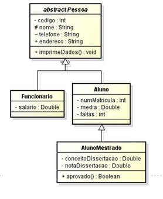
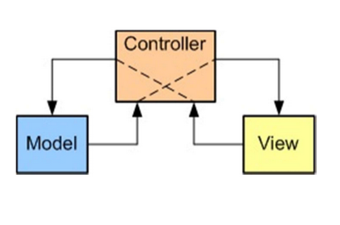
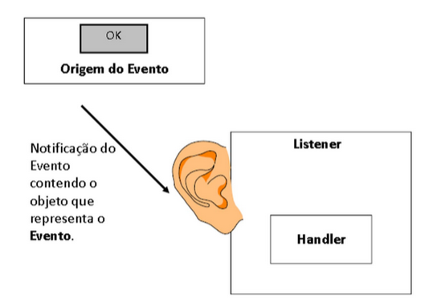

# Monitoria de Programação Orientada a Objetos
Os exemplos e exercícios resolvidos neste repositório são inspirados no material do professor Marcos Aurélio Domingues (UEM), baseado nos materiais dos professores Edson Oliveira (UEM), Michelle Nery (IFSuldeMinas) e Bruno Boniati (UFSM).
## Exemplo 1: Classes Abstratas

## Calculadora com interface Gráfica Swing 
Uma implementação de uma calculadora simples seguindo o padrão arquitetural MVC (Model, View, Control).

Utiliza componentes **Swing** para interface gráfica, com modelo de delegação de eventos.

Este exercício é uma boa forma de trabalhar os princípios SOLID de programação orientada a objetos:
* Single responsability principle 
  + Toda classe e método deve ter apenas uma responsabilidade.
* Open-closed principle 
  + Entidades abertas para extensão, mas fechadas para modificação
* Liskov substitution principle
  + Polimorfismo.
* Interface segregation principle
  + Desacoplamento.
